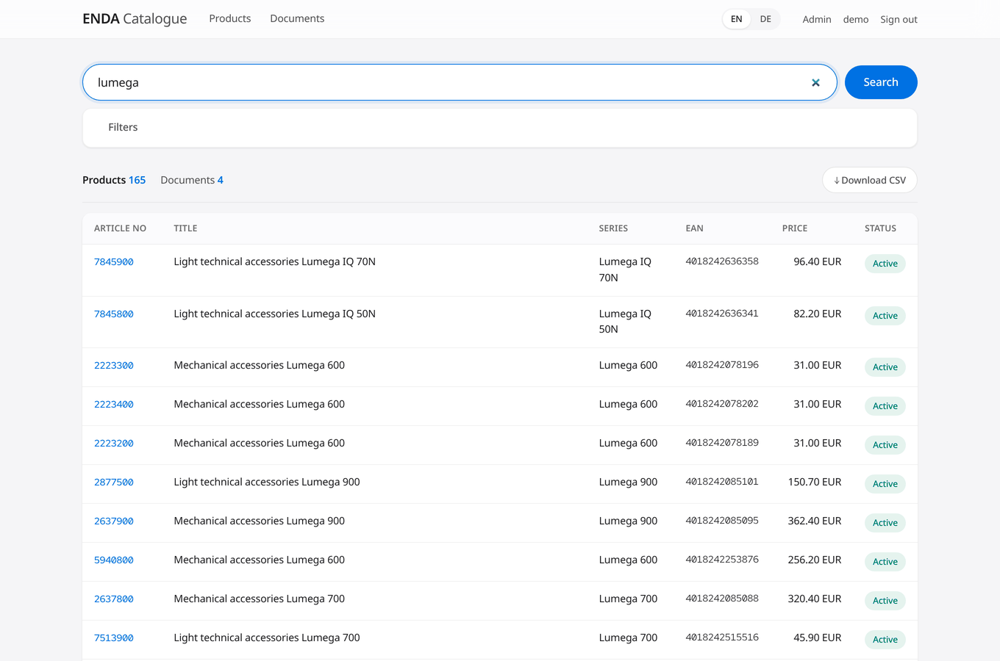
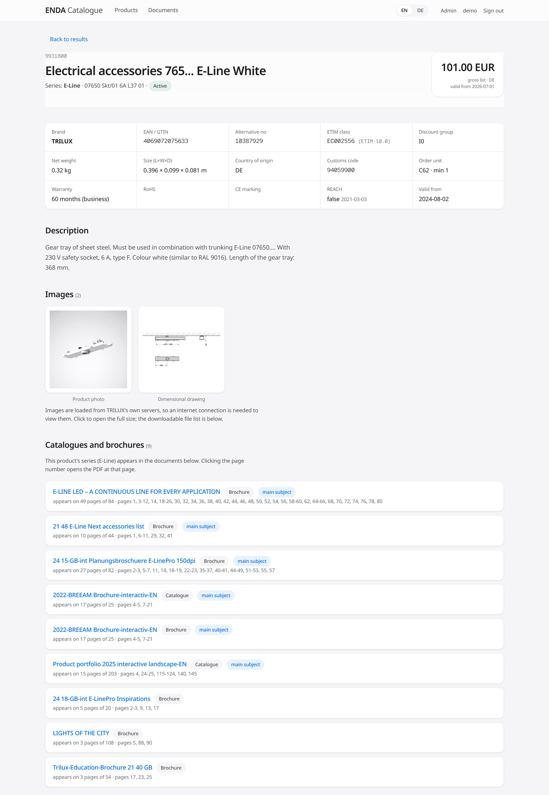
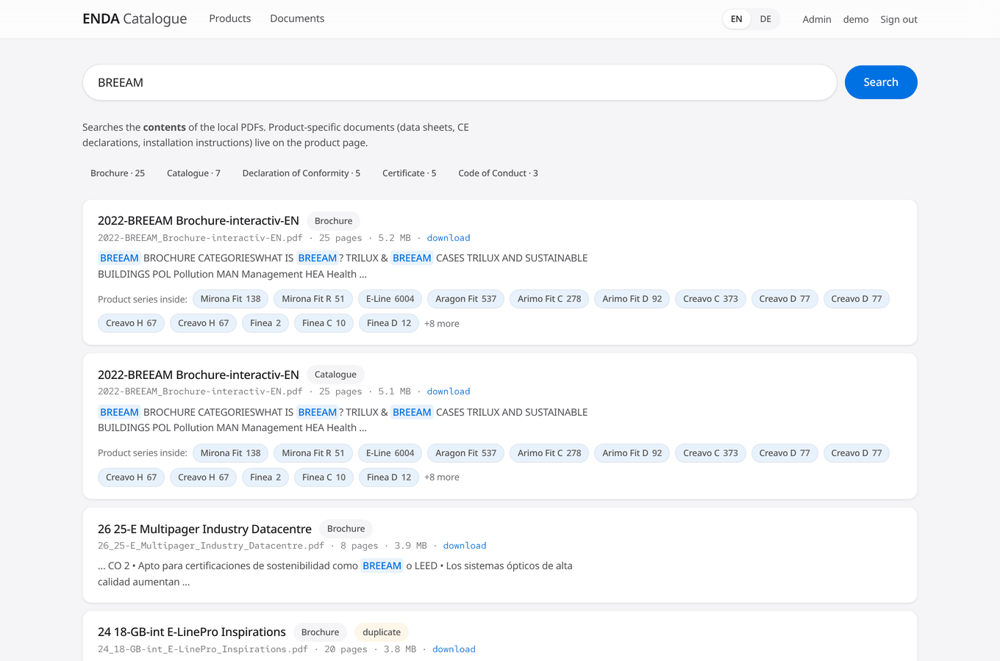
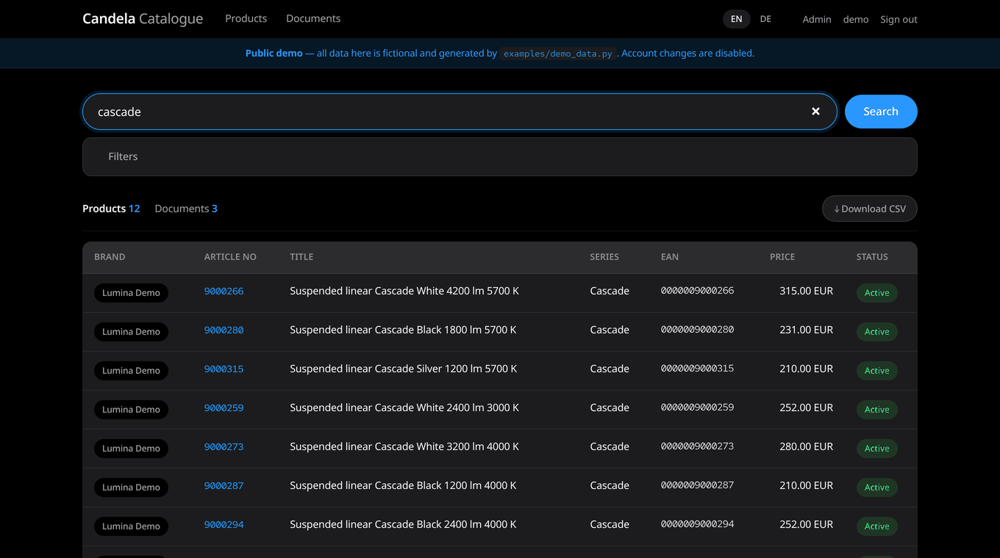
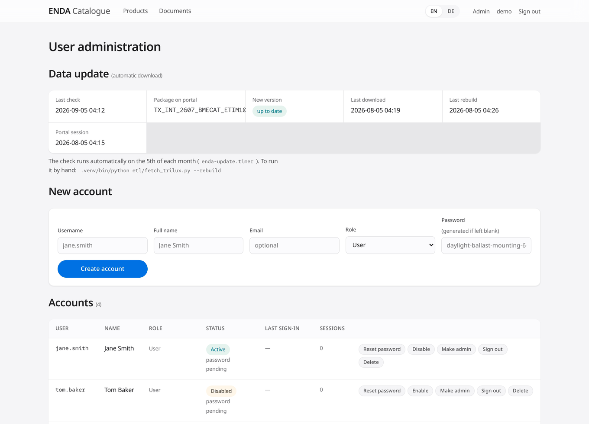

# ENDA — Product and Document Catalogue

A catalogue search tool for lighting distributors. It ingests **BMEcat 2005 / ETIM**
product data together with PDF documents and builds a single **SQLite** database with
full-text search on top, served through a small web interface.

It was written for a real daily problem: turning a multi-gigabyte XML file and a pile
of PDFs into something where you can type an article number, find the data sheet, and
see which catalogue it appears in.

**Why it exists:** the BMEcat package TRILUX publishes is a single 1.4 GB XML file —
over 30,000 products with roughly 88 technical attributes each. Excel will not open it,
it is not searchable, and the documents live somewhere else entirely. This tool turns
it into a searchable database in about a minute.

## Try it

**Live demo: <https://demo.mariaftaieh.com>** — sign in with `demo` / `demo1234demo`.

Or run your own copy in one command:

```bash
git clone https://github.com/Maria-Ftaieh/enda-catalogue-db.git
cd enda-catalogue-db
docker compose up
```

Then open <http://localhost:8000> and sign in with the same credentials.

Both are filled with a **completely fictional** dataset — an invented brand
("Lumina Demo"), 96 products across 8 made-up series, generated PDFs and placeholder
images. No manufacturer's real data is involved. It is produced by
[`examples/demo_data.py`](examples/demo_data.py), which you can read, run and modify:

```bash
python3 examples/demo_data.py          # write brands/demo/ and the placeholder images
python3 examples/demo_data.py --clean  # remove them again
```

The first container start generates the data and builds the database (a minute or
two); later starts reuse the volume and are immediate. If port 8000 is taken:
`HOST_PORT=8080 docker compose up`.

> The image deliberately leaves out Playwright/Chromium (~400 MB), so the automatic
> download in `etl/fetch_trilux.py` does not work inside the container. Everything
> else does.



---

## Contents

- [Try it](#try-it)
- [What it does](#what-it-does)
- [Input: what data it accepts](#input-what-data-it-accepts)
- [Output: the database you get](#output-the-database-you-get)
- [Installation](#installation)
- [Running it](#running-it)
- [Adding a brand](#adding-a-brand)
- [Automatic data updates](#automatic-data-updates)
- [User accounts](#user-accounts)
- [Server deployment (HTTPS)](#server-deployment-https)
- [Security](#security)
- [Known limitations](#known-limitations)
- [Project layout](#project-layout)

---

## What it does

- **Search:** exact matching on article number / EAN / alternative code, or prefix
  full-text search across descriptions and series names (typing `inplan` finds
  `Inplana`). A typical search returns in under 20 ms.
- **Product page:** key facts, gross price and price tiers, ETIM technical features,
  **embedded product photos, ambient shots and dimensional drawings**, every file the
  manufacturer hosts (data sheet, CE declaration, RoHS, REACH, EPD, installation
  instructions, photometric LDT/IES, Revit/BIM), accessories, similar products and
  "used as an accessory by".
- **Document search:** searches **inside** the local PDFs, with highlighted excerpts.
- **Catalogue ↔ product links:** "this product is in that brochure, page 12" — clicking
  opens the PDF at that page.
- **Multiple brands** side by side, with no code changes.
- **Bilingual product data:** the source feed carries German and English text; both are
  stored and a EN/DE switch in the header changes which one is displayed.
- CSV export, a JSON API, per-person accounts and role management.

### Screenshots

**Product page** — key facts, embedded images, and the catalogues the product's series
appears in, down to the page number:



**Document search** — searches inside the PDFs, with highlighted excerpts and the
product series each document covers:



**Dark mode** — follows the operating system setting, no toggle needed:



**Administration** — accounts, roles and the status of the automatic data update:



> The screenshots show real catalogue rows from a TRILUX feed, prices included. They
> are illustrative only; see [About the prices](#about-the-prices).

---

## Input: what data it accepts

### 1. Product data — BMEcat 2005 / ETIM

The tool reads **BMEcat 2005 XML classified against ETIM**
(`xmlns="https://www.etim-international.com/bmecat/50"`). This is the common
interchange format used by European electrical and lighting manufacturers — it is not
specific to TRILUX. Any manufacturer publishing the same format works.

Fields that are read:

| BMEcat node | Used for |
|---|---|
| `SUPPLIER_PID`, `SUPPLIER_ALT_PID`, `INTERNATIONAL_PID` | article number, alternative code, EAN/GTIN |
| `DESCRIPTION_SHORT` / `DESCRIPTION_LONG` (`lang="deu"` and `"eng"`) | title and description, bilingual |
| `MANUFACTURER_TYPE_DESCR`, `KEYWORD`, `PRODUCT_STATUS` | type, keywords, status |
| `PRODUCT_FEATURES` → `REFERENCE_FEATURE_GROUP_ID`, `FEATURE/FNAME`, `FVALUE` | ETIM class and technical features |
| `PRODUCT_PRICE_DETAILS` → `PRODUCT_PRICE`, `LOWER_BOUND` | gross price and price tiers |
| `PRODUCT_REFERENCE type="accessories"` / `"similar"` | accessory and similar-product links |
| `PRODUCT_LOGISTIC_DETAILS`, `CUSTOMS_NUMBER`, `COUNTRY_OF_ORIGIN` | customs code, country of origin |
| `UDX.EDXF.MIME_INFO` → `MIME_SOURCE`, `MIME_CODE` | image and document links |
| `UDX.EDXF.PRODUCT_SERIES`, `TENDER_TEXT`, `PACKING_UNITS`, `WARRANTY`, `REACH`, `ROHS_INDICATOR` | series, tender text, packaging, warranty, compliance |

`UDX.EDXF.MIME_CODE` values are labelled as follows (the `mime_code` table):

| Code | Meaning | Code | Meaning |
|---|---|---|---|
| MD01 | Product photo | MD22 | Product data sheet |
| MD04 | Manufacturer product page | MD37 | Revit / BIM file |
| MD05 | REACH declaration | MD39 / MD45 | Installation / feature video |
| MD12 | Dimensional drawing | MD46 | 360° image |
| MD14 / MD21 | Installation / user manual | MD47 | Thumbnail |
| MD19 | Photometric data (LDT/IES/ULD) | MD49 | RoHS declaration |
| MD20 | Ambient photo | MD52 | CE declaration of conformity |
| MD54 | Environmental product declaration (EPD) | MD56 | Warranty conditions |

**File size is not a problem:** the XML is streamed with `iterparse` and only one
`<PRODUCT>` is held in memory at a time. A 1.4 GB file is processed in about 40 seconds
at flat memory use.

### 2. Documents — PDF

Any PDF. Its text is extracted page by page and indexed; the file is served in the
browser and can be downloaded. PDFs without a text layer (scanned images) are still
listed — only their contents cannot be searched.

### 3. Directory layout

The input is defined entirely by the directory structure; there is no configuration
file:

```
brands/
  <brand-code>/              lowercase, no spaces (trilux, zumtobel …)
    brand.json               {"name": "TRILUX", "colour": "#003d6b"}   (optional)
    data/                    BMEcat XML — nesting is free, the largest .xml wins
    documents/
      Catalogue/             the directory name becomes the category shown in the UI
      Certificate/
      Brochure/
```

- `data/` may be empty → the brand appears with its documents only.
- `documents/` may be empty → product data only.
- Directories starting with `_` are ignored (`brands/_example-brand/` is a template).

---

## Output: the database you get

A single **SQLite** file: `data/catalogue.db`. No server to run; copy it anywhere.
With the full TRILUX catalogue it is about 1 GB.

### Tables

| Table | Holds | Example size (TRILUX) |
|---|---|---|
| `brand` | brand record (code, name, colour) | 1 |
| `product` | the product record — 55 columns | 30,736 |
| `product_feature` | ETIM technical features (code + value) | 2,957,937 |
| `product_mime` | image and document links | 723,900 |
| `product_ref` | accessory / similar-product links | 682,997 |
| `product_price` | price tiers | 30,736 |
| `packing_unit` | packing units, sizes and weights | 53,980 |
| `characteristic` | manufacturer-specific extra fields | 134,475 |
| `product_keyword` | keywords | 96,969 |
| `doc` | local PDFs (path, category, pages, sha1) | 45 |
| `doc_page` | page-by-page text of the PDFs | 1,131 |
| `doc_series` | catalogue ↔ product-series links | 406 |
| `mime_code` | MIME code → readable label | 18 |
| `catalog_info` | per-brand catalogue metadata | — |

Plus two **FTS5** full-text indexes:

- `product_fts` — over article number, EAN, series, title, description and keywords.
  It is an *external content* table over `product`, so the text is not stored twice.
- `doc_fts` — PDF title and body, providing highlighted excerpts via `snippet()`.

Both use `unicode61 remove_diacritics 2` and `prefix='2 3 4'`: accents are folded and
prefix searches are answered from the index.

### Querying it directly

The database is plain SQLite and does not depend on the application:

```sql
-- Active products between 100 and 200 that have a CE declaration
SELECT p.supplier_pid, p.short_en, p.price_amount
FROM product p
WHERE p.status = 'Aktiv'
  AND p.price_amount BETWEEN 100 AND 200
  AND EXISTS (SELECT 1 FROM product_mime m
              WHERE m.product_id = p.id AND m.code = 'MD52')
ORDER BY p.price_amount;

-- Full-text search
SELECT p.supplier_pid, p.short_en
FROM product_fts f JOIN product p ON p.id = f.rowid
WHERE product_fts MATCH '"lumega"*'
ORDER BY bm25(product_fts) LIMIT 20;
```

---

## Installation

The quickest path is [Docker](#try-it) above. What follows is a native install.

Tested on **AlmaLinux 10** with Python 3.12. Package names differ on Debian/Ubuntu;
everything else is the same.

### 1. Requirements

| | |
|---|---|
| Python | 3.11+ with `sqlite3` compiled **with FTS5** |
| Disk | ~3 GB (1.4 GB source XML + 1 GB database + scratch space) |
| RAM | 2 GB is enough; the ETL uses flat memory |
| Internet | for product images and manufacturer files (optional) |

Check FTS5 support:

```bash
python3 -c "import sqlite3; sqlite3.connect(':memory:').execute('create virtual table t using fts5(x)'); print('FTS5 OK')"
```

### 2. Get the code and create the virtualenv

```bash
git clone <repository-url> enda && cd enda
python3 -m venv .venv
.venv/bin/pip install --upgrade pip
.venv/bin/pip install -r requirements.txt
```

### 3. (Optional) A browser, for the automatic download

Only needed for `etl/fetch_trilux.py`. Skip it if you copy the files in by hand.

```bash
# AlmaLinux / RHEL
dnf install -y nss atk at-spi2-atk cups-libs libdrm libxkbcommon libXcomposite \
               libXdamage libXfixes libXrandr mesa-libgbm alsa-lib pango cairo \
               at-spi2-core libxshmfence
# Debian / Ubuntu
# .venv/bin/playwright install-deps chromium

.venv/bin/playwright install chromium
```

### 4. Put the data in place

```bash
mkdir -p brands/trilux/data brands/trilux/documents/Catalogue
echo '{"name": "TRILUX"}' > brands/trilux/brand.json
```

Copy the (unzipped) BMEcat XML under `brands/trilux/data/` and the PDFs under
`brands/trilux/documents/<Category>/`.

### 5. Build the database

```bash
.venv/bin/python etl/build_db.py        # XML  -> SQLite    (~60 s for 30k products)
.venv/bin/python etl/index_docs.py      # PDF text          (~90 s the first time)
.venv/bin/python etl/link_catalogs.py   # catalogue <-> product (~5 s)
```

Each script reports what it did, ending with row counts and a coverage summary.

### 6. Create the first administrator

```bash
.venv/bin/python etl/users.py add <username> --admin --name "Your Name"
```

Note the generated password — it is not shown again. You will be asked to choose your
own password on first sign-in.

### 7. Run it

```bash
./run.sh                 # http://127.0.0.1:8000
./run.sh 0.0.0.0 8000    # listen on the network (read the security section first)
```

---

## Running it

| Command | Purpose |
|---|---|
| `./run.sh` | development server |
| `.venv/bin/python etl/build_db.py` | rebuild the product database from scratch |
| `.venv/bin/python etl/index_docs.py` | index new/changed PDFs (incremental via sha1) |
| `.venv/bin/python etl/link_catalogs.py` | rebuild the catalogue ↔ product links |
| `.venv/bin/python etl/users.py list` | list the accounts |
| `.venv/bin/python etl/fetch_trilux.py --check` | check the portal for a new version |

**Important:** `build_db.py` rebuilds the database **from scratch**, dropping `doc`,
`doc_page` and `doc_series` with it. The order is therefore always
`build_db` → `index_docs` → `link_catalogs`.

User accounts live in a **separate** file (`data/users.db`) and survive this cycle.

---

## Adding a brand

No code changes are required:

```bash
mkdir -p brands/zumtobel/{data,documents/Catalogue}
echo '{"name": "Zumtobel", "colour": "#c8102e"}' > brands/zumtobel/brand.json
# copy the files in, then:
.venv/bin/python etl/build_db.py && \
.venv/bin/python etl/index_docs.py && \
.venv/bin/python etl/link_catalogs.py
```

With more than one brand present, a brand filter, a brand column in the results and
brand tabs on the Documents page appear by themselves.

Article numbers are unique **within a brand**; two brands may use the same number.
Catalogue↔product matching also stays inside a brand, so one brand's brochure never
matches another brand's series.

---

## Automatic data updates

`etl/fetch_trilux.py` downloads the current package from the TRILUX portal. The portal
is behind SAML SSO and its login form is drawn in JavaScript, so a real browser
(Playwright/Chromium) is used. The session is opened once, stored in
`/etc/trilux/session.json` and reused, so later runs do not log in at all.

```bash
.venv/bin/python etl/fetch_trilux.py --check     # is there a new version?
.venv/bin/python etl/fetch_trilux.py --rebuild   # download + rebuild
.venv/bin/python etl/fetch_trilux.py --reset     # clear the login lock
```

Credentials live outside the repository with `chmod 600`: copy
`examples/trilux.env.example` to `/etc/trilux/trilux.env` and fill it in.

**Account lock protection:** the TRILUX account locks after 5 failed attempts. The
script makes **at most one** login attempt per run and **stops itself after two
consecutive failures**, refusing to try again until `--reset` is passed. It therefore
cannot lock the account.

For monthly runs use `examples/enda-update.{service,timer}`. This automation is
**TRILUX-specific**; every manufacturer portal differs, so other brands' files are
copied in by hand.

---

## User accounts

Sign-in is per person. Only an administrator creates accounts; there is no
self-registration.

- An **administrator** creates accounts, resets passwords, disables or deletes
  accounts and ends sessions from the `/admin` page.
- A new user **must choose their own password on first sign-in**.

```bash
.venv/bin/python etl/users.py add jane --name "Jane Smith"
.venv/bin/python etl/users.py add john --admin
.venv/bin/python etl/users.py password jane
.venv/bin/python etl/users.py disable jane
.venv/bin/python etl/users.py clear-locks --all
```

---

## Server deployment (HTTPS)

The application only listens on `127.0.0.1`; the reverse proxy is the door to the
outside.

```bash
cp examples/enda.service /etc/systemd/system/
systemctl daemon-reload && systemctl enable --now enda

dnf install -y caddy
cp examples/Caddyfile.example /etc/caddy/Caddyfile   # edit the domain
mkdir -p /var/log/caddy && chown caddy:caddy /var/log/caddy
firewall-cmd --permanent --add-service=http --add-service=https && firewall-cmd --reload
systemctl enable --now caddy
```

Caddy obtains and renews the certificate from Let's Encrypt automatically. The example
configuration also sends HSTS, CSP and `X-Frame-Options`.

> **Note:** running `caddy validate` as `root` creates the log file owned by root and
> the service then fails to start. `chown -R caddy:caddy /var/log/caddy` fixes it.

---

## Security

| Area | Implementation |
|---|---|
| Password storage | scrypt **n=2¹⁷, r=8, p=1** (OWASP's primary recommendation), per-user salt |
| Legacy records | hashes made with cheaper parameters are silently upgraded on the next sign-in |
| Session token | 32 bytes of entropy; only its SHA-256 digest is stored |
| Cookie | `HttpOnly` + `Secure` + `SameSite=Lax` |
| Brute force | 5 failures per username / 15 min **and** 30 failures per IP / 15 min |
| Password change | ends every session on the user's other devices |
| User enumeration | a hash is computed even for unknown users; messages are identical |
| CSRF | session-bound HMAC token on every state-changing form |
| Transport | HSTS, CSP (no inline scripts), `X-Frame-Options: DENY` |
| Database | the application opens the main database **read-only** |

The expensive password hash runs **after** the rate-limit checks, so the hashing cost
cannot be turned into a denial-of-service lever.

**Demo mode** (`DEMO_MODE=1`) is meant for a public instance: it prints the
credentials on the sign-in page, shows a banner, and refuses every account change, so
a visitor cannot lock the demo for everyone. Leave it off for a real installation.

**Never committed** (see `.gitignore`): `data/users.db` (password hashes),
`data/.secret_key`, `data/*.db`, `brands/*/data/*`, `brands/*/documents/*`, `*.env`.

### About the prices

Prices in BMEcat packages are usually the manufacturer's gross list prices for dealers
**in its own market**, and are not binding (for TRILUX: Germany and Austria). If you
expose the system outside the company, keep that data behind the login, or blank the
price fields in `etl/build_db.py` and rebuild.

---

## Known limitations

- **ETIM features are shown as codes.** The BMEcat file gives features as codes only
  (`EF000007 = EV000154`); the readable names live in the ETIM International dictionary
  and are not part of the package. With the dictionary in hand, no reload is needed:
  add two translation tables (`etim_feature`, `etim_value`) and `LEFT JOIN` them onto
  `product_feature`.
- **Product documents stay on the manufacturer's servers.** The database stores links,
  not the files — for TRILUX that is over 700,000 of them. Those links need internet
  access.
- **Scanned PDFs cannot be searched.** Files without a text layer are listed and can be
  opened, but are only findable by title. OCR (`ocrmypdf`) would be needed.
- **Catalogue↔product links are at series level**, not per product: catalogues do not
  print article numbers, they talk about series.
- **Automatic downloading exists for TRILUX only.**
- Not implemented yet: two-factor authentication (TOTP), breached-password checks, an
  administrative audit log, session idle timeout.

---

## Project layout

```
Dockerfile           container image (no Playwright, see "Try it")
docker-compose.yml   one-command demo
docker/entrypoint.sh generates demo data, builds the database, creates the first admin
etl/
  brands.py          discovers the brand directories (used by all three ETL scripts)
  schema.sql         table definitions
  build_db.py        BMEcat XML -> SQLite (streamed, flat memory)
  index_docs.py      extracts PDF text page by page (incremental via sha1)
  link_catalogs.py   links catalogues to product series
  fetch_trilux.py    downloads the package from the TRILUX portal (Playwright)
  users.py           account management from the command line
web/
  app.py             the FastAPI application
  auth.py            accounts, passwords, sessions and authorisation
  templates/         Jinja2 templates
  static/            styles and page behaviour (no CDN, no webfonts)
brands/              per-brand data and document directories
examples/
  demo_data.py       generates the fictional demo dataset
  *.service, *.timer systemd unit samples
  Caddyfile.example  reverse proxy sample
data/                generated databases (never committed)
```

---

## Licence

MIT — see `LICENSE`.

The licence covers **the code in this repository only**. Manufacturers' BMEcat data,
catalogues, images and documents belong to their respective owners and are not
distributed here.
